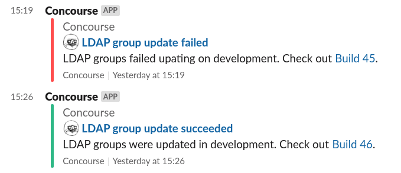

# generate-pretty-message

A task to generate a pretty message.



## Usage

```yaml
  - name: generate-pretty-message
    file: common-tasks-repo/generate-pretty-message/latest/generate-pretty-message.yml
    params:
      AUTHOR: 'Concourse'
      COLOUR: '#4EC2C5'
      MESSAGE: 'This is the message to send. It **may** contain [markdown](https://daringfireball.net/projects/markdown/basics) and emojis! :tada:'
      TITLE: 'This is a title. Also with emojis! :tada:'
    - put: slack-notification
        params:
          channel: "#my-channel"
          attachments_file: slack-attachment/attachment.json
```
